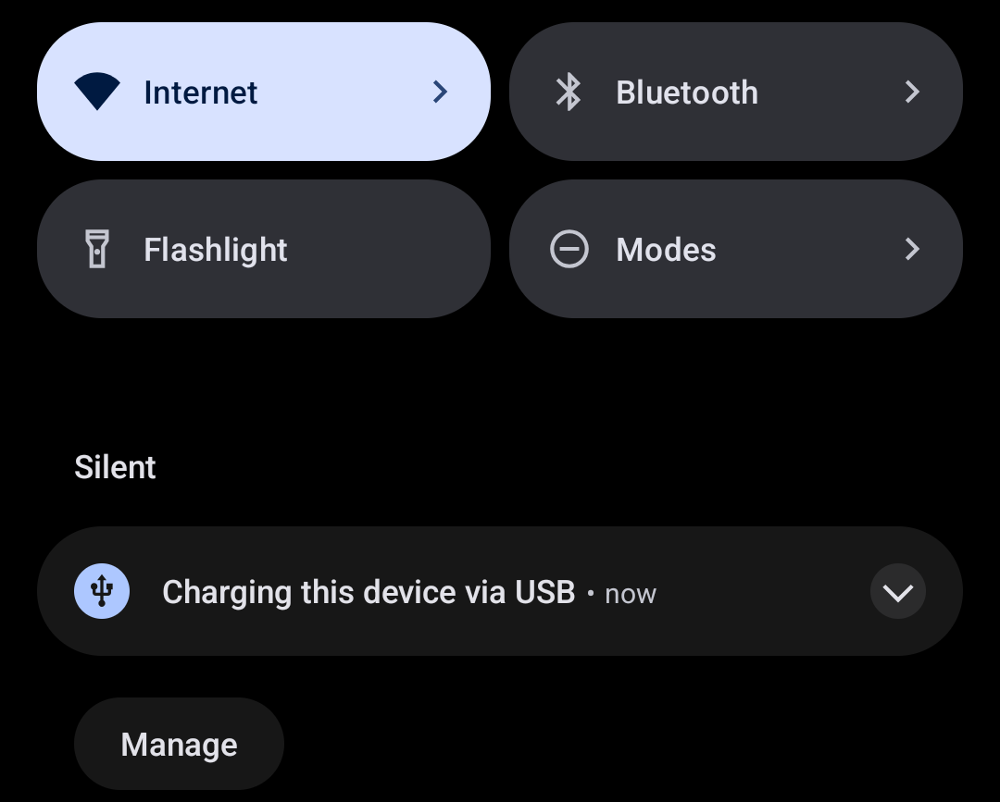
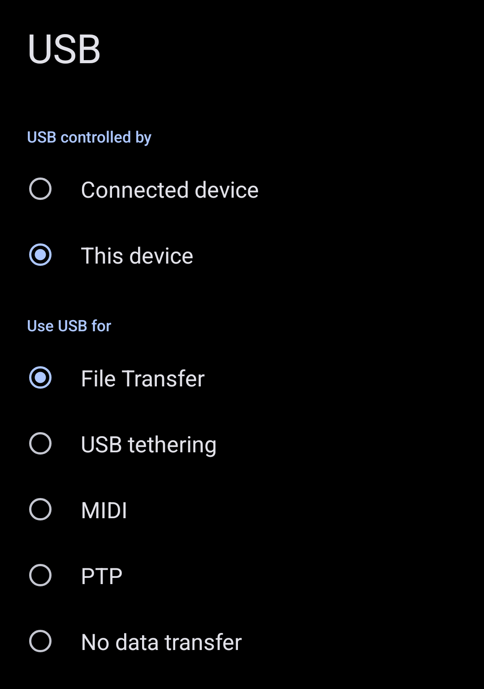

PREVIEW.gif

mtp-tui is a TUI for easily mounting and umounting your phone's storage!

# Table of Contents

- [Installation](#installation)
- [Usage](#usage)
- [Configuration](#configuration)
- [Known issues](#known-issues)
- [Contributing](#contributing)
- [Licence](#licence)

# Installation
First, clone this repository and run `go build` on its root directory:

```shell
git clone https://github.com/aguirre-matteo/mtp-tui
cd mtp-tui
go build
```

Then copy the binary to somewhere in your $PATH. For example, copy it to `/usr/bin/`:

```shell
cp ./mtp-tui /usr/bin/
```

# Usage 
The mtp-tui command must be run with `sudo`, so it can access the
device's storage. Use the `-u` flag for specifying under which user's 
config the program will be running:

```shell
mtp-tui -u yourusername
```

This will open the TUI, showing all the detected devices in that moment.
You can move through the elements using the arrow keys or HJKL.

If you haven't already connected your device, it's now time to do so.
Connect your phone to your computer and swipe down the screen and you'll
find a notification saying that the device has been connected.



Then touch it and the USB's Connection details will open. Select the "File Transfer"
option in the "Use USB for" section. This way you'll be able to access your phone's 
storage.



Now, in your computer, press "r" on mtp-tui and the device list will update. Make sure
you update the list after changing to "File Transfer" mode. Otherwise, you won't be able 
to access your files.

# Configuration
A simple YAML config file can be place under `/etc/mtp-tui.yml` (for root) or `~/.config/mtp-tui.yml`
(other users) to configure mounting options. Here's an example config showing all the available options,
and its default values:

```yaml
mount:
  point: /mtp/                             # Where devices will be mounted. If the user is different from root, it will be ~/mtp/
  options: default_permissions,allow_other # Mount options. These ensure your user has access to the drive.
                                           # default_permissions ensures the mounted FS inherits his parent directory's permissions.
```

# Known issues
At the date of writing this guide, there're is no easy way to mount a phone without root permissions.
There are also some bugs regarding to LIBMTP and Jmtpfs, and this app throws an exception when trying to
run it without `sudo`, so the best option for now is to use `sudo` along the `-u` flag.

# Contributing
If you want to contribute to this project, you have some options to do so:

- Solving an open issue.
- Open an issue reporting a bug or requesting a feature.
- Spread this project in forums, or recommending it to someone else.

# Licence
This program is distributed under the MIT Licence. See the details [here](LICENSE).
