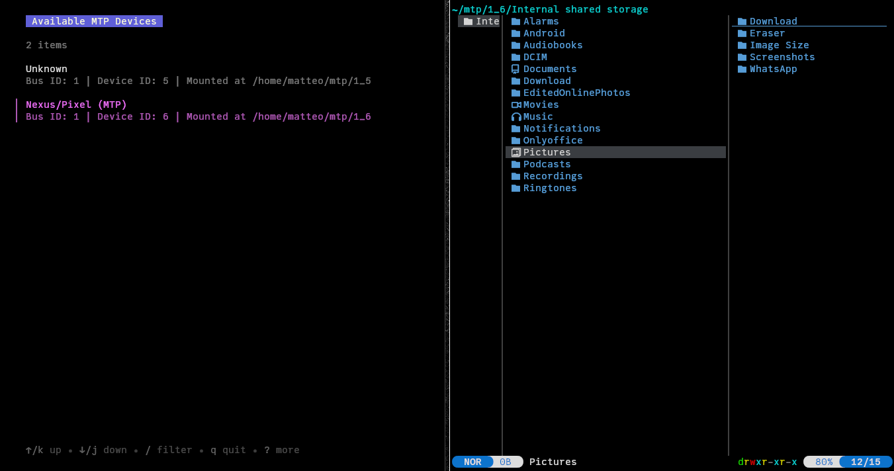
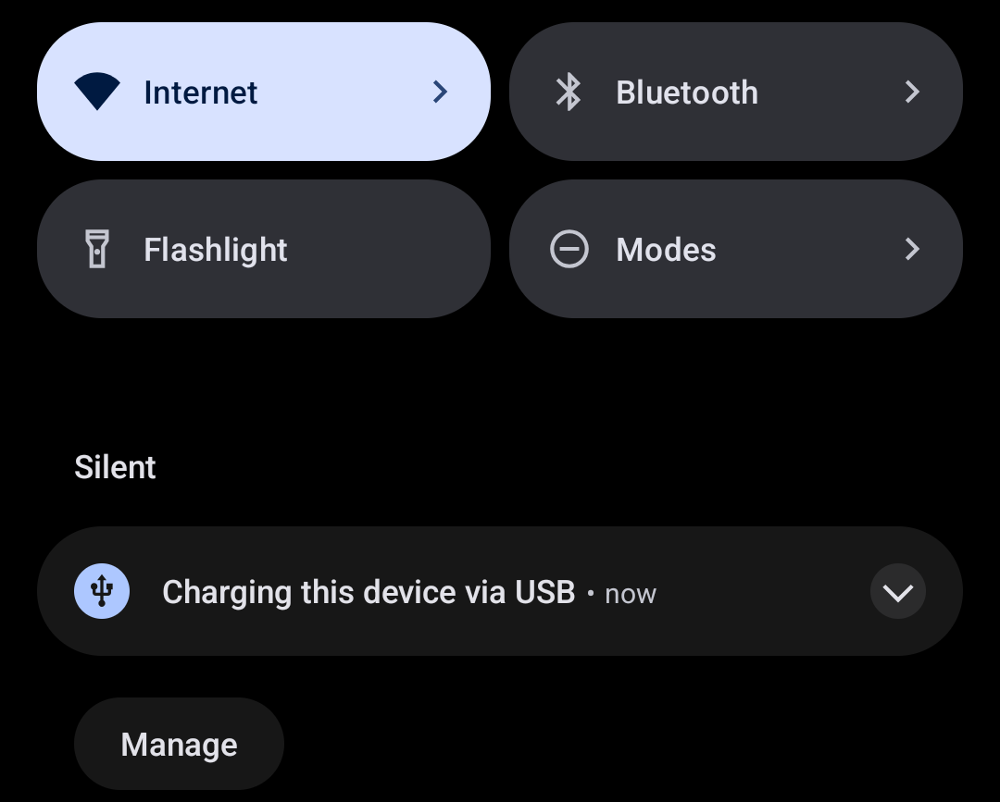
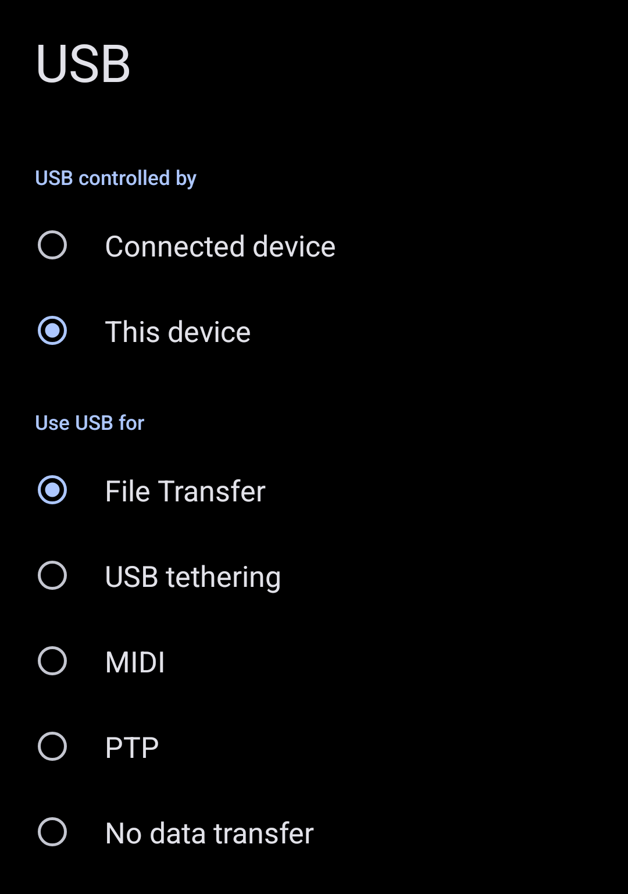

Mtp-Tui is a terminal user interface for easily mounting and umounting your MTP devices.
Android phones, digital cameras and media players fall under this category.

# Table of Contents
- [Getting Started](#getting-started)
    - [Installation](#installation)
    - [Usage](#usage)
    - [Configuration](#configuration)
- [Nix](#nix)
    - [Flake](#flake)
    - [Modules](#modules)
- [Contributing](#contributing)
- [Licence](#licence)

# Getting Started

## Installation
The first step is to clone this Git repository and enter to it:

```shell
[myuser@linux:~/workdir]$ git clone https://github.com/aguirre-matteo/mtp-tui
Cloning into 'mtp-tui'...
remote: Enumerating objects: 151, done.
remote: Counting objects: 100% (151/151), done.
remote: Compressing objects: 100% (111/111), done.
remote: Total 151 (delta 55), reused 117 (delta 31), pack-reused 0 (from 0)
Receiving objects: 100% (151/151), 199.84 KiB | 1.19 MiB/s, done.
Resolving deltas: 100% (55/55), done.

[myuser@linux:~/workdir]$ cd mtp-tui

```

Then run `cargo install --path .` to start the compilation process and install the
binary to your `~/.cargo/bin/`. Make sure you have this directory added in your `$PATH`.

```shell
[myuser@linux:~/workdir/mtp-tui]$ cargo install --path .
  Installing mtp-tui v0.1.0 (/home/myuser/workdir/mtp-tui)
    Updating crates.io index
     Locking 148 packages to latest Rust 1.86.0 compatible versions
      Adding generic-array v0.14.7 (available: v0.14.9)
      Adding unicode-width v0.2.0 (available: v0.2.2)
    Finished `release` profile [optimized] target(s) in 4.82s
  Installing /home/myuser/.cargo/bin/mtp-tui
   Installed package `mtp-tui v0.1.0 (/home/myuser/workdir/mtp-tui)` (executable `mtp-tui`)
```

## Usage 
All you have to do to start the program is to type `mtp-tui` in your terminal.
This will open the interface, showing all the detected devices in that moment.
You can move through the elements using the arrow keys or J and K.

If you haven't already connected your device, now it's time to do so.
In the case of an Android phone, connect it to your computer, swipe down
the screen and you'll find a notification saying that the device has been connected.



Then click on it and the USB's Connection details will open. Select the "File Transfer"
option in the "Use USB for" section. This way you'll be able to access your phone's 
storage.



> [!WARNING]
> When you connect a new device, by default it won't be configured as "File Transfer".
> If you don't manually change the device mode, `mtp-tui` will fail when umounting the device
> because FUSE will create an empty directory owned by `root` since it cannot access the phone's filesystem.

Now, in your computer, press "r" on the app and the device list will update. Make sure
you update the list after changing to "File Transfer" mode. Otherwise, you won't be able 
to access your files.

## Configuration
A simple YAML config file can be placed on `/etc/mtp-tui.yml` or `~/.config/mtp-tui.yml`
to configure mounting options. Here's an example config showing all the available options,
and its default values:

```yaml
colors:
  title_font: "#FFFFFF"                  # Font color for the "Available MTP Devices" title
  title_background: "#5F5FD7"            # Background color for the title
  selected_device: "#C86EC8"             # Font color the selected device should use

mount:
  point: /home/myuser/mtp                  # Directory where mounted devices should be placed. Each device will have it's own
                                           # subdirectory here (e.g. mtp/1_10, mtp/1_11, ...).
  options: "None"                          # Extra mount options to pass as arguments to 'jmtpfs'. All the available options can 
                                           # be discovered by running 'jmtpfs -h'.
```

# Nix
> [!NOTE]
> This guide assumes you have flakes enabled in your Nix config.
> If not, see the [official wiki](https://wiki.nixos.org/wiki/Flakes).

To install Mtp-Tui through Nix, this project provides both a NixOS and a Home-Manager module.

## Flake
First, add this repository to your flake's inputs:

```nix
{
  inputs = {
    # ...
    mtp-tui.url = "github:aguirre-matteo/mtp-tui";
  };
}
```

Then add the NixOS and Home-Manager modules in your configuration. You should also
add this flake's overlay. Otherwise Nix wouldn't be able to find the package:

```nix
{
  outputs = { self, nixpkgs, home-manager, ...}@inputs: {
    nixosConfigurations.nixos = nixpkgs.lib.nixosSystem {
      # ...
      modules = [
        ./configuration.nix
        inputs.mtp-tui.nixosModules.mtp-tui # <--- This installs the NixOS module
        
        home-manager.nixosModules.home-manager
        {
          home-manager = {
            # ...
            sharedModules = [
              inputs.mtp-tui.homeManagerModules.mtp-tui # <--- This installs the Home-Manager module
            ];
          };
        }
        {
          nixpkgs.overlays = [
            inputs.mtp-tui.overlays.mtp-tui # <--- This installs the Nixpkgs overlay
          ];
        }
      ];
    };
  };
}
```

## Modules
These are the options implemented by both NixOS and Home-Manager modules at `programs.mtp-tui`:

| Option     | NixOS module                | Home-Manager module             |
|------------|-----------------------------|---------------------------------|
| `enable`   | Enables the app             | Enable the app                  |
| `package`  | The package                 | The package                     |
| `settings` | /etc/mtp-tui.yml config     | ~/.config/mtp-tui.yml config    |

Here's an example config:
```nix
{ pkgs, ... }:

{
  programs.mtp-tui = {
    enable = true;
    settings = {
      colors = {
        title_font = "#000000";
        title_background = "#FFFFFF";
        selected_device = "#FFFFFF";
      };
      mount = {
        point = "/home/youruser/Documents/mtp";
        options = "default_permissions,allow_other";
      };
    };
  };
}
```

# Contributing
If you want to contribute to this project, you have some options to do so:

- Solving an issue.
- Open an issue reporting a bug or requesting a feature.
- Spread this project in forums, or recommending it to someone else.

# Licence
This program is distributed under the MIT Licence. See the details [here](LICENSE).
